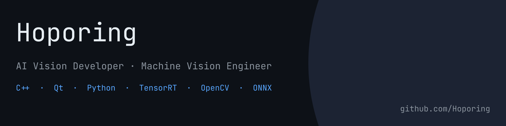
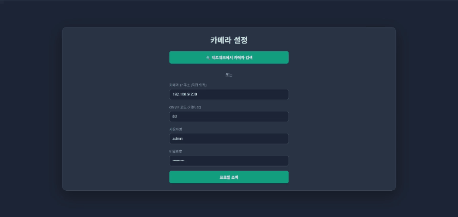
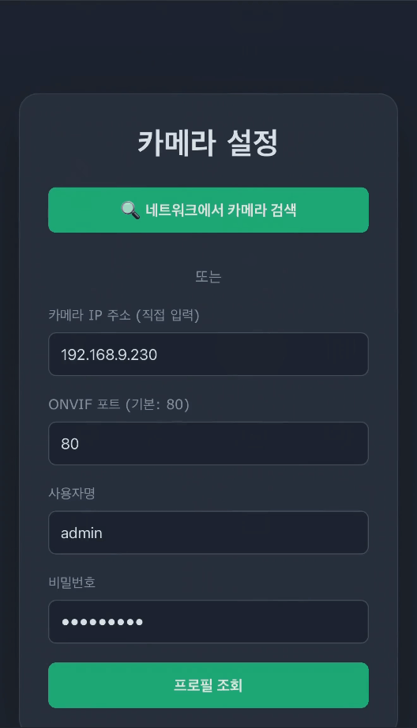

# Web_Monitoring

Flask 기반 ONVIF Network Camera Web Monitoring Application.  
Network 내 ONVIF Camera를 자동으로 탐색하고, Browser에서 실시간 Streaming과 녹화를 지원합니다.

---

## 실행 화면

**PC**



**Mobile**



---

## 주요 기능

- **ONVIF Camera 자동 탐색** — PC의 Network Interface Subnet 전체를 병렬 Scan (ThreadPoolExecutor)
- **Multi Profile 지원** — ONVIF Profile별 해상도 / FPS 조회 및 선택
- **실시간 Streaming** — go2rtc 연동으로 RTSP → WebSocket MSE / WebRTC 이중 지원
- **Server-side 녹화** — fMP4 Init Segment 보존 방식, MP4 파일 Download
- **Multi Session** — 동일 Camera Stream을 여러 Session이 공유
- **Session 관리** — Flask Session 기반 인증, Secret Key 영속화
- **외부 접속** — Cloudflare Tunnel (cloudflared) 연동으로 인터넷 어디서나 접속 가능

---

## 기술 스택

| 분류 | 내용 |
|------|------|
| 언어 | Python 3.12+ |
| Web Framework | Flask, flask-sock |
| Streaming | go2rtc (RTSP → WebSocket / WebRTC) |
| Camera Protocol | ONVIF (python-onvif-zeep) |
| 병렬처리 | ThreadPoolExecutor |

---

## 사전 요구사항

- Python 3.12+
- [go2rtc](https://github.com/AlexxIT/go2rtc/releases) 실행 파일을 프로젝트 폴더에 배치

---

## 설치 및 실행

```bash
git clone https://github.com/Hoporing/Web_Monitoring.git
cd Web_Monitoring

pip install flask flask-sock onvif-zeep netifaces requests websocket-client

# go2rtc.yaml.example을 복사하여 go2rtc.yaml 생성 후 스트림 설정
cp go2rtc.yaml.example go2rtc.yaml

# go2rtc.exe를 프로젝트 폴더에 복사 후 실행
python bridge.py
```

Browser에서 `http://localhost` 접속

---

## License

본 프로젝트 소스코드는 [MIT License](LICENSE)를 따릅니다.

사용된 오픈소스 라이브러리:

| Library | License |
|---------|---------|
| Flask | BSD-3 |
| go2rtc | MIT |
| python-onvif-zeep | MIT |
